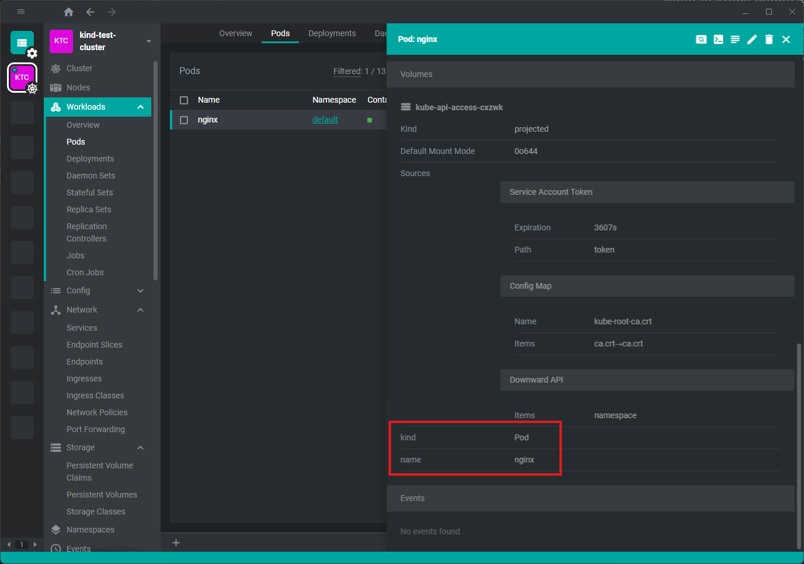

# Kube object detail items

## What is kubeObjectDetailItems?

kubeObjectDetailItems allows you to add a custom component in the drawer panel of a resource like a `Pod` or an `Event`.
You can see your component by clicking on a pod (or another supported resource kind) and scrolling to the bottom of the drawer.

<figure markdown="span">
  
</figure>

# How to use it
## Interface

This is the kubeObjectDetailItems interface

```javascript
kubeObjectDetailItems: KubeObjectDetailRegistration[] = [];
```

KubeObjectDetailRegistration is defined as follows

```javascript linenums="1"
export interface KubeObjectDetailRegistration<T extends KubeObject = KubeObject<KubeObjectMetadata<KubeObjectScope>, any, any>,> {
  kind: string;
  apiVersions: string[];
  components: KubeObjectDetailComponents<T>;
  priority?: number;
  visible?: IComputedValue<boolean>;
}
```

## Hands on
To add a new custom component in the drawer menu, let’s create a new custom component.

```react linenums="1"
import { Renderer } from "@freelensapp/extensions";

import styleInline from "./example-details.scss?inline";
const {
  Component: { DrawerItem },
} = Renderer;

type KubeObject = Renderer.K8sApi.KubeObject;
type KubeObjectDetailsProps<TKubeObject extends KubeObject> = Renderer.Component.KubeObjectDetailsProps<TKubeObject>;

export const ExampleDetails = ({ object }: KubeObjectDetailsProps<Renderer.K8sApi.KubeObject>) => {

  return (
    <>
      <style>{styleInline}</style>
      <div className="ExampleDetails">
        <DrawerItem name="kind">
          { object.kind }
        </DrawerItem>
        <DrawerItem name="name">
          { object.metadata.name }
        </DrawerItem>
      </div>
    </>
  );
}
```

And then just add this block of code to your `renderer/index.tsx` file.

```javascript linenums="1"
kubeObjectDetailItems = [
  {
    kind: "Pod",
    apiVersions: ["v1"],
    priority: 1,
    components: {
      Details: (props: KubeObjectDetailsProps<Renderer.K8sApi.KubeObject>) => <ExampleDetails {...props} />,
    },
  },
  {
    kind: "Event",
    apiVersions: ["v1"],
    priority: 1,
    components: {
      Details: (props: KubeObjectDetailsProps<Renderer.K8sApi.KubeObject>) => <ExampleDetails {...props} />,
    },
  },
];
```

You can see all the properties of kubeObject <a href="https://github.com/freelensapp/freelens/blob/main/packages/kube-object/src/kube-object.ts" target="_blank" rel="noopener noreferrer">here</a>.
